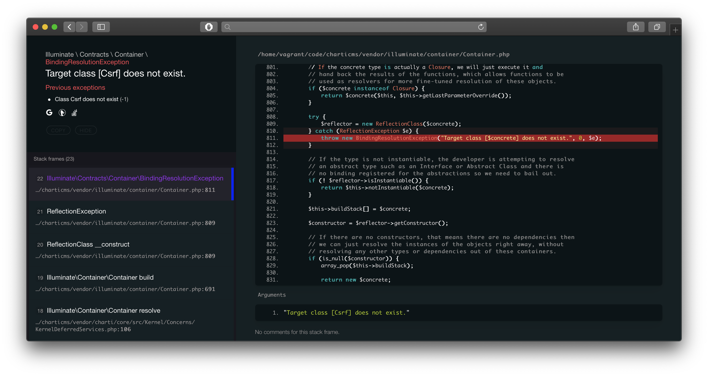

# Wups
Modern PHP Debugger for cool developers (Originally forked from Whoops).

[](https://packagist.org/packages/filp/whoops)
[](https://packagist.org/packages/filp/whoops)
[](https://github.com/filp/whoops/actions?query=workflow%3ATests)
[](https://travis-ci.org/filp/whoops)
[](https://scrutinizer-ci.com/g/filp/whoops)
[](https://scrutinizer-ci.com/g/filp/whoops)

-----



**Wups** is an error handler framework for PHP. Out-of-the-box, it provides a pretty
error interface that helps you debug your web projects, but at heart it's a simple yet
powerful stacked error handling system.

**Why Wups not Whoops?**
Wups is a modified version of Whoops.<br>
First of, with Wups you get a nice modern dark theme by default (the light one is work in progress). All necessary Javascript is written in pure Vanilla.

Also, **Wups will never disclose environment details.** So, you can let the Wups Debugger ON even when you're in production. (which is not really recommended... really).

## Features

- Flexible, stack-based error handling
- Stand-alone library with (currently) no required dependencies
- Simple API for dealing with exceptions, trace frames & their data
- Includes a pretty rad error page for your webapp projects
- Includes the ability to [open referenced files directly in your editor and IDE](docs/Open%20Files%20In%20An%20Editor.md)
- Includes handlers for different response formats (JSON, XML, SOAP)
- Easy to extend and integrate with existing libraries
- Clean, well-structured & tested code-base
- Modern dark theme
- Light theme (todo tweaks)
- Manual switcher

## TODOS
- Switching themes based on OS preference / Include manual switcher
- Wups in Background **App Monitoring, Error Tracking & Reporting Support**

## Installing

1. Composer to go (not published yet):

    ```bash
    composer require georgelemon/wups
    ```

1. Register the pretty handler in your code:

    ```php
    $whoops = new \Wups\Run;
    $whoops->pushHandler(new \Wups\Handler\PrettyPageHandler);
    $whoops->register();
    ```

For more options, have a look at the **example files** in `examples/` to get a feel for how things work. Also take a look at the [API Documentation](docs/API%20Documentation.md) and the list of available handlers below.

You may also want to override some system calls Wups does. To do that, extend `Wups\Util\SystemFacade`, override functions that you want and pass it as the argument to the `Run` constructor.

### Switching themes
Since Wups you can choose from dark/light theme. By default, dark theme will be enabled.
You can manually choose the theme by specifying 'dark', or 'light' to the THEME constant, like
```php
    /**
     * Default theme
     */
protected const THEME = 'dark';
```

### Available Handlers

**Wups**, like it's predecessor (Whoops), ships with the following built-in handlers, available in the `Wups\Handler` namespace:

- [`PrettyPageHandler`](https://github.com/filp/whoops/blob/master/src/Whoops/Handler/PrettyPageHandler.php) - Shows a pretty error page when something goes pants-up
- [`PlainTextHandler`](https://github.com/filp/whoops/blob/master/src/Whoops/Handler/PlainTextHandler.php) - Outputs plain text message for use in CLI applications
- [`CallbackHandler`](https://github.com/filp/whoops/blob/master/src/Whoops/Handler/CallbackHandler.php) - Wraps a closure or other callable as a handler. You do not need to use this handler explicitly, **whoops** will automatically wrap any closure or callable you pass to `Whoops\Run::pushHandler`
- [`JsonResponseHandler`](https://github.com/filp/whoops/blob/master/src/Whoops/Handler/JsonResponseHandler.php) - Captures exceptions and returns information on them as a JSON string. Can be used to, for example, play nice with AJAX requests.
- [`XmlResponseHandler`](https://github.com/filp/whoops/blob/master/src/Whoops/Handler/XmlResponseHandler.php) - Captures exceptions and returns information on them as a XML string. Can be used to, for example, play nice with AJAX requests.

You can also use pluggable handlers, such as [SOAP handler](https://github.com/whoops-php/soap).

## Authors

Wups is maintained by George Lemon. Originally forked from [Whoops](https://github.com/filp/whoops), by [Filipe Dobreira](https://github.com/filp) & [Denis Sokolov](https://github.com/denis-sokolov). A lot of awesome fixes and enhancements were also sent in by [various contributors](https://github.com/filp/whoops/contributors). Special thanks to [Graham Campbell](https://github.com/GrahamCampbell) and [Markus Staab](https://github.com/staabm) for continuous participation.

This software includes [Prettify](https://github.com/google/code-prettify), licensed under Apache License 2.0. It is bundled only as a performance optimization.
